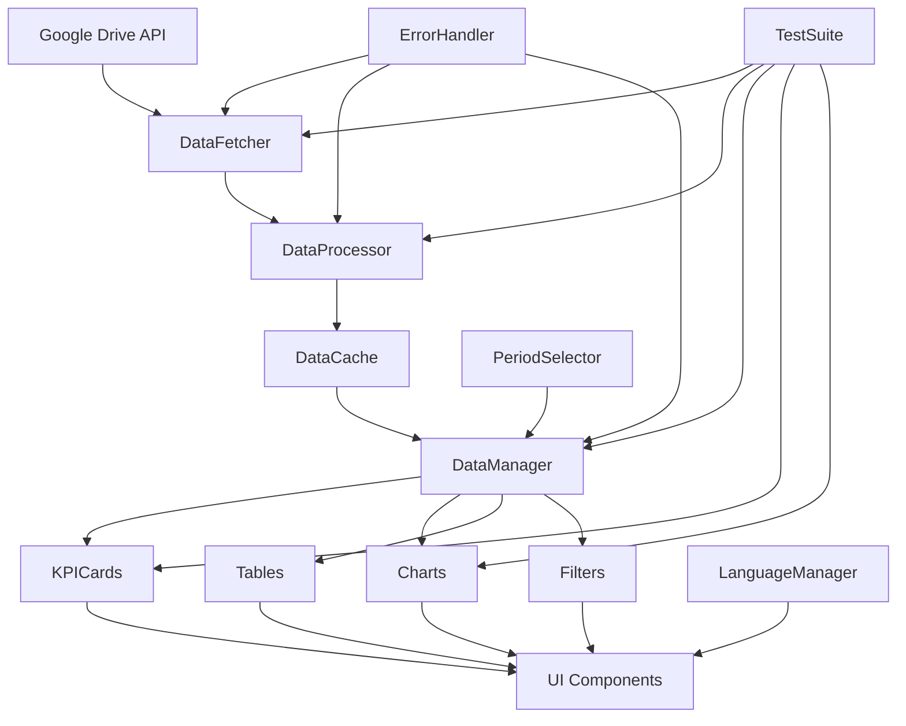

# QIP Trainer Dashboard - 의존성 맵 및 우선순위

## 🗺️ Phase 2: 의존성 맵 작성 및 우선순위 결정

### 📦 시스템 아키텍처 의존성 맵



### 🔍 컴포넌트 의존성 분석

#### 1. 핵심 데이터 레이어 (Core Data Layer)
```
GoogleDriveAPI (신규)
    ↓
DataFetcher (신규)
    ├── 의존: Google API Client
    ├── 영향: DataProcessor, ErrorHandler
    └── 우선순위: ★★★★★
    
DataProcessor (개선)
    ├── 의존: DataFetcher
    ├── 영향: DataCache, DataManager
    └── 우선순위: ★★★★★
    
DataCache (신규)
    ├── 의존: DataProcessor
    ├── 영향: DataManager
    └── 우선순위: ★★★★☆
    
DataManager (개선)
    ├── 의존: DataCache, DataProcessor
    ├── 영향: 모든 UI 컴포넌트
    └── 우선순위: ★★★★★
```

#### 2. UI 컴포넌트 레이어
```
KPICards
    ├── 의존: DataManager, LanguageManager
    ├── 영향: Dashboard View
    └── 우선순위: ★★★★☆
    
Charts (Chart.js)
    ├── 의존: DataManager, Chart.js Library
    ├── 영향: Performance, Risk, Trend Views
    └── 우선순위: ★★★☆☆
    
Tables
    ├── 의존: DataManager, LanguageManager
    ├── 영향: TQC List, Performance Table
    └── 우선순위: ★★★☆☆
```

#### 3. 제어 레이어 (Control Layer)
```
PeriodSelector
    ├── 의존: None
    ├── 영향: DataManager, All UI Components
    └── 우선순위: ★★★★☆
    
Filters
    ├── 의존: DataManager
    ├── 영향: Tables, Charts
    └── 우선순위: ★★☆☆☆
```

### 🎯 우선순위 매트릭스

| 우선순위 | 컴포넌트 | 의존성 수 | 영향도 | 구현 순서 |
|---------|---------|----------|--------|----------|
| P0 (긴급) | ErrorHandler | 0 | 100% | 1 |
| P0 (긴급) | GoogleDriveAPI | 0 | 95% | 2 |
| P0 (긴급) | DataFetcher | 1 | 90% | 3 |
| P1 (높음) | DataProcessor | 2 | 85% | 4 |
| P1 (높음) | DataCache | 1 | 70% | 5 |
| P1 (높음) | DataManager | 2 | 100% | 6 |
| P2 (중간) | KPICards | 2 | 40% | 7 |
| P2 (중간) | PeriodSelector | 0 | 60% | 8 |
| P3 (낮음) | Charts | 2 | 30% | 9 |
| P3 (낮음) | Tables | 2 | 25% | 10 |
| P3 (낮음) | Filters | 1 | 20% | 11 |

### 🔧 모듈 분리 계획

#### Step 1: 기본 구조 생성
```
/src
  /api
    - googleDrive.js      # Google Drive API 연동
    - dataFetcher.js      # 데이터 가져오기
  /core
    - dataProcessor.js    # 데이터 처리
    - dataCache.js        # 캐싱 로직
    - dataManager.js      # 데이터 관리
    - errorHandler.js     # 에러 처리
  /components
    - kpiCards.js         # KPI 카드
    - charts.js           # 차트 컴포넌트
    - tables.js           # 테이블 컴포넌트
  /utils
    - formatter.js        # 데이터 포맷팅
    - validator.js        # 데이터 검증
    - constants.js        # 상수 정의
  /tests
    - unit/              # 단위 테스트
    - integration/       # 통합 테스트
    - e2e/              # E2E 테스트
```

#### Step 2: 의존성 주입 패턴
```javascript
// Dependency Injection Container
class DIContainer {
    constructor() {
        this.services = new Map();
    }
    
    register(name, factory) {
        this.services.set(name, factory);
    }
    
    get(name) {
        if (!this.services.has(name)) {
            throw new Error(`Service ${name} not found`);
        }
        return this.services.get(name)();
    }
}

// Usage
const container = new DIContainer();
container.register('dataFetcher', () => new DataFetcher());
container.register('dataProcessor', () => new DataProcessor(container.get('dataFetcher')));
```

### 📊 리스크 분석

| 리스크 | 발생 가능성 | 영향도 | 대응 방안 |
|--------|------------|--------|----------|
| Google API 연동 실패 | 중 | 높음 | 폴백 메커니즘 구현 |
| 데이터 형식 변경 | 높음 | 중 | 유연한 파서 구현 |
| 성능 저하 | 중 | 중 | 점진적 로딩 구현 |
| 브라우저 호환성 | 낮음 | 중 | 폴리필 사용 |
| 메모리 누수 | 중 | 높음 | 자동 정리 메커니즘 |

### 🚀 구현 로드맵

#### Phase 3 준비 (격리된 단위 개발)
1. **Week 1**: 핵심 모듈 개발
   - ErrorHandler (2일)
   - GoogleDriveAPI (3일)
   - DataFetcher (2일)

2. **Week 2**: 데이터 레이어
   - DataProcessor (3일)
   - DataCache (2일)
   - DataManager (2일)

3. **Week 3**: UI 컴포넌트
   - KPICards (2일)
   - Charts (3일)
   - Tables (2일)

4. **Week 4**: 테스트 및 통합
   - 단위 테스트 (3일)
   - 통합 테스트 (2일)
   - 성능 최적화 (2일)

### 📝 체크리스트

#### 즉시 수정 사항
- [ ] break문 누락 수정
- [ ] XSS 취약점 패치
- [ ] 기본 에러 핸들러 추가

#### 모듈 분리
- [ ] HTML에서 JavaScript 분리
- [ ] CSS 모듈화
- [ ] 컴포넌트별 파일 생성

#### API 연동
- [ ] Google OAuth 설정
- [ ] Drive API 권한 설정
- [ ] 데이터 동기화 로직

#### 테스트 환경
- [ ] Jest 설정
- [ ] 테스트 케이스 작성
- [ ] CI/CD 파이프라인

### 🎨 설계 원칙

1. **단일 책임 원칙 (SRP)**: 각 모듈은 하나의 책임만
2. **의존성 역전 원칙 (DIP)**: 추상화에 의존
3. **개방-폐쇄 원칙 (OCP)**: 확장에는 열려있고 수정에는 닫혀있음
4. **인터페이스 분리 원칙 (ISP)**: 작고 구체적인 인터페이스
5. **리스코프 치환 원칙 (LSP)**: 서브타입은 언제나 기반 타입으로 교체 가능

---
*작성일: 2025-09-11*
*다음 단계: Phase 3 - 격리된 단위 개발*